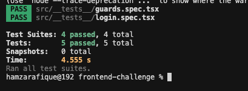

# Pickup & Delivery — React Native (Expo)

A small mobile app implementing Logi, Delivery Preference, Summary using Expo, styled-components, React Navigation and Zustand. It runs entirely on-device (no backend).

[![Watch the demo]](./assets/videos/demo.mp4)

Alternatively, download or open the video directly: [assets/videos/demo.mp4](./assets/videos/demo.mp4)

## Getting Started

- Install: `npm i`
- Run: `npx expo start`

## Tech & Decisions

- Navigation: React Navigation (native-stack) with deep link scheme `pickupapp://`
- State: Zustand with AsyncStorage persistence (auth + preference)
- Styling: styled-components with typed theme and light/dark modes
- Validation: Yup (inline errors on blur, submit disabled until valid)
- UX:
  - Sticky bottom actions via Screen `bottomContent`
  - Native date/time pickers in modals; 24h format; store hours enforced (09:00–21:00)
  - Address autocomplete with local suggestions (Fuse.js), overlay dropdown
  - Summary in a themed card; floating red sign-out action with confirm dialog

## Flows

- Login: any valid email + password length ≥ 6; redirects to Preference
- Preference: choose In-store, Delivery, or Curbside
  - In-store: date & time
  - Delivery: address, date & time
  - Curbside: car description, date & time
  - Future date/time enforced; store hours 09:00–21:00 enforced with inline hint on clamp
- Summary: shows email, selection, and fields; Edit to go back; Sign out clears state

## Tests

Run tests:

```
npm test
```

## Demo



## What I'd Improve with More Time

- More test coverage (future time blocking, summary values)
- Polished animations (picker sheet, dropdown)
- Better tablet layout and landscape tweaks
- Internationalization (i18n)
